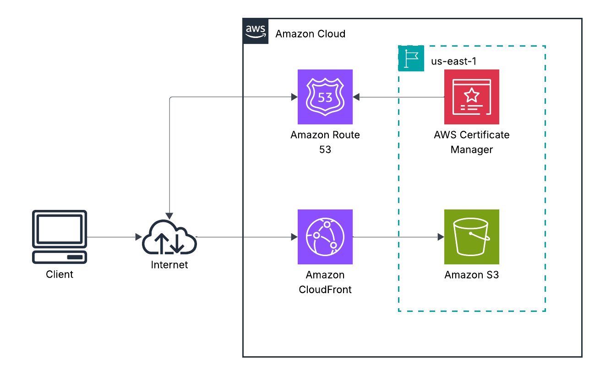
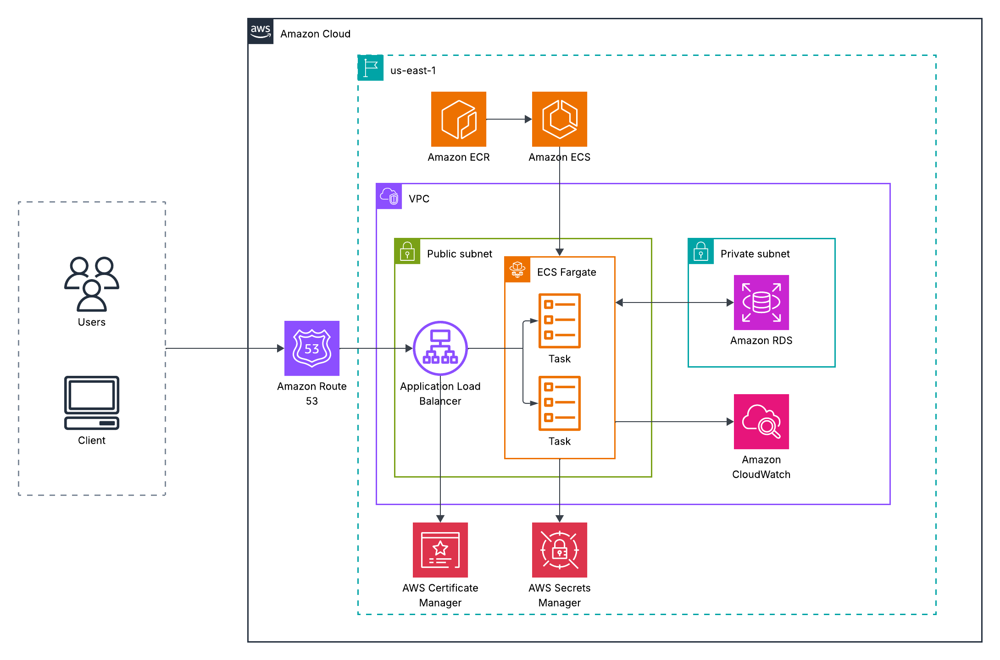
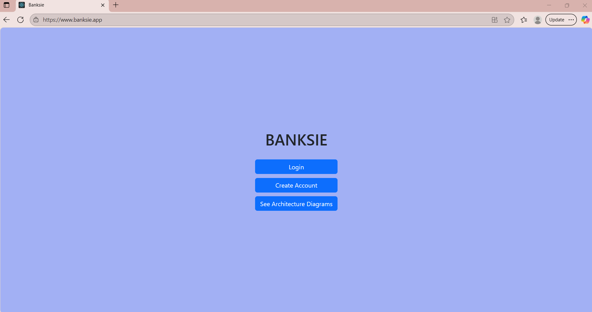
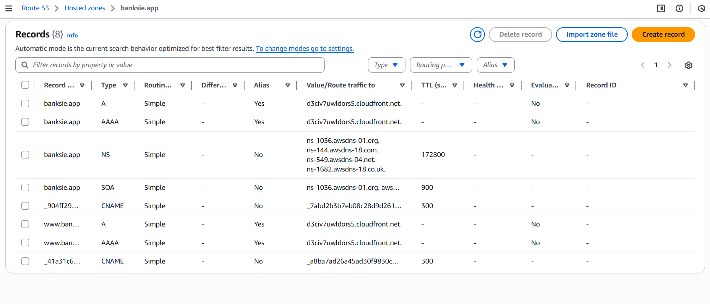
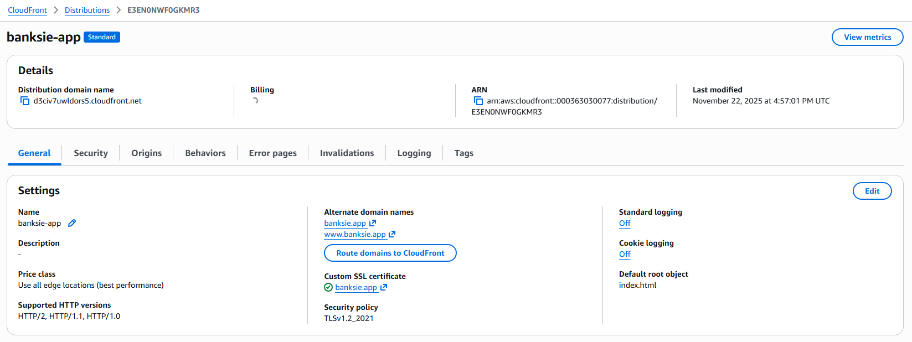
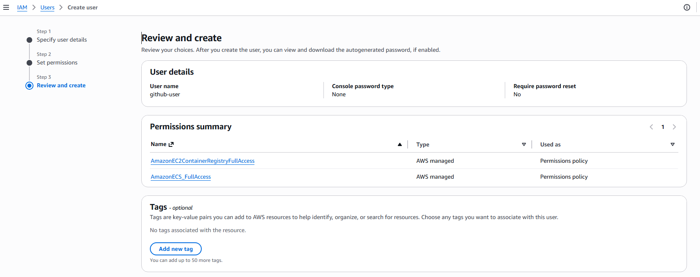
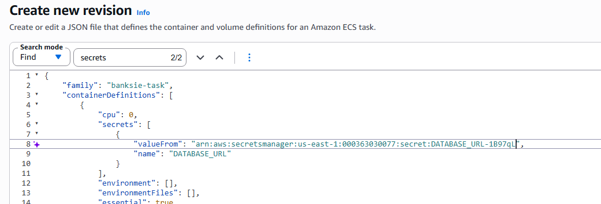
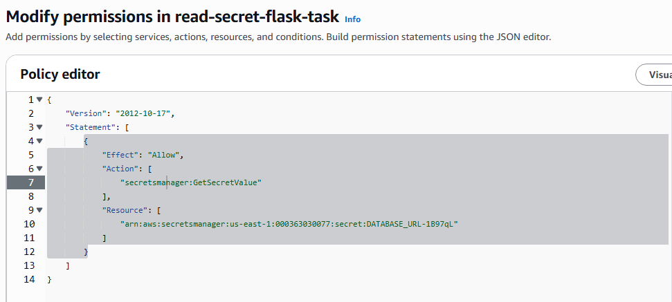
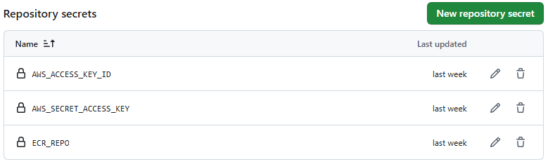
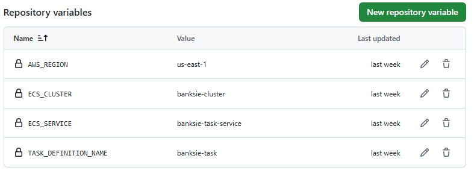

# Full-Stack Flask Application Deployed on AWS with Github Actions

  
Table of Contents

  <ol>
    <li>
      <a href="#-overview">Overview</a>
      <ul>
        <li><a href="#-tech">Tech</a></li>
        <ul>
          <li><a href="#application">Application</a></li>
          <li><a href="#aws-infrastructure">AWS Infrastructure</a></li>
          <li><a href="#devops--cicd">DevOps / CI/CD</a></li>
          <li><a href="#dev-tools">Dev Tools</a></li>
        </ul>
      </ul>
    </li>
    <li>
      <a href="#%EF%B8%8F-architecture-setup">Architecture Setup</a>
      <ul>
        <li><a href="#%EF%B8%8F-frontend">Frontend</a></li>
        <li><a href="#%EF%B8%8F-database">Database</a></li>
        <li><a href="#%EF%B8%8F-backend">Backend</a></li>
      </ul>
    </li>
    <li><a href="#-troubleshooting">Troubleshooting</a></li>
    <li><a href="#-what-i-learned">What I Learned</a></li>
    <li><a href="#-contact">Contact</a></li>
  </ol>

## ❓ Overview
Built and deployed a scalable multi-tier banking application on AWS, leveraging S3, ECS, and RDS, and automated the backend deployment process through a GitHub Actions CI/CD pipeline.

### Frontend 

### Backend and Database

### Live Website

For more screenshots, click [here](./screenshots)

## 🧰 Tech
### Application
* Python (Flask)
* React
* PostgreSQL
  
### AWS Infrastructure
* Route 53
* Cloud Front 
* S3
* ECS
* ECR
* IAM
* RDS (PostgreSQL)
* VPC
* EC2 (Security Groups and Load Balancer)
* Secrets Manager
* CloudWatch

### DevOps / CI/CD
* Github Actions
* Docker
* ECR

### Dev Tools
* Docker Compose
* Insomnia

## 🏗️ Architecture Setup

### 🖥️ Frontend
   1. Registered a domain using a domain registrar `banksie.app`
   2. Created a private S3 bucket with the same name as the root domain and added frontend files
   3. Used Route 53 as the DNS service for the domain 
      - Created a hosted zone (named hosted zone the root domain: banksie.app)
      - Added Route 53 nameservers for the hosted zone to the domain registrar used to register domain
      - Made sure nameservers propagated (Can take up to 48 hours)
   4. Created a CloudFront distribution with the origin as the S3 bucket 
   5. Added root domain (banksie.app) and subdomain `www.banksie.app` as alternate domains for CF distribution
   6. Requested SSL Certificate from AWS Certificate Manager
      - Included root domain and subdomain in certificate
      - ACM added CNAME records and A/AAAA records to the hosted zone, but this can be done manually

      - Once certificate was issued, added certificate to CF distribution
      - Added index.html as the default root object in the CF distribution
      - Wait for CF distribution to redeploy
    
     
### 🛢️ Database
   1. Created a database in RDS
      - Choose full configuration
      - PostgreSQL
      - Free tier
      - Created username and password
      - Choose instance configuration (Burstable classes / db.t3.micro)
      - Storage type: General Purpose SSD, 20 GiB
      - Choose VPC (must be the same that ECS tasks use)
      - Created new VPC security group to be configured later (flask-rds-sg)
      - Port: 5432
   2. Added the database endpoint to Flask app .env file (local testing)
   3. Created environment variable in AWS Secrets Manager console for database URL
      - Added a secret for the database URL
      - Choose "other type of secret"
      - Added database URL in plain text
     
### ⚙️ Backend
   1. Created an IAM user to handle ECR and ECS 
      - Attached policies:
         - AmazonEC2ContainerRegistryFullAccess - allows user to use AWS ECR
         - AmazonECS_FullAccess - allows user to use AWS ECS
        
      - Generated access key for the user to be user later
   3. Created repository for ECS image in AWS ECR
   4. Created an ECS Cluster
   5. Created a Task Definition
      - Name the task definition family (banksie-task)
      - Launch type = Fargate
      - CPU = .5 vCPU
      - Memory 2 GB
      - Create default task execution role
      - Container
        - Name container (banksie-container)
        - Add image URI (add :latest at the end)
        - Define port mapping = TCP Port 80 HTTP (Gunicorn is listening on port 80 in flask app)
   6. Revised the task definition with JSON to include the secret made using the secret arn
      
      
   8. Created and attached an inline policy to the task execution role to read secrets from AWS Secrets Manager
      
   10. Created ALB in EC2 console
      - Added listener for HTTP and HTTPS
        - Requested new ACM certificate for api.banksie.app
        - Added A record to Route 53 for api.banksie.app (will need time to propagate)
      - Created a security group for ALB (flask-app-alb-sg)
        - Allow inbound HTTP and HTTPS traffic from anywhere
      - Created target group for ecs tasks (For an IP but do not add any targets)
        - Add health check path as /health
        - In Flask app added route for /health to return code 200
      - Add ALB url to frontend code files
      - Add new files to S3 bucket
   11. Created security group to be used by ECS tasks (banksie-sg)
       - Allow HTTP traffic from ALB created on port 80
       - Allow outbound traffic to RDS database
       - Modified the ALB security group to allow outbound traffic to this security group
   12. Created a service (banksie-task-service)
       - Added task definition previously created (banksie-task)
       - Choose capacity provider strategy (FARGATE)
       - Desired tasks = 1
       - Networking
         - Choose VPC (same as database)
         - Choose all subnets in us-east-1
       - Added banksie-sg security group previously created
       - Added ALB that was previously created
       - Service will have an error until we push an image
   14. Configured RDS security group previously created
       - Added inbound rule so the task security group (banksie-sg) can access the RDS on port 5432
   15. Pushed Docker image to ECR via AWS CLI
       - Configured AWS CLI credentials using access keys from IAM user created
       - Logged into ECR
       - Built/tagged docker image
       - Pushed image to ECR
   16. Updated the service using a revised task with the "latest" image
   17. Set up Github Actions for automatic deployments
       - Added secrets and variables to the Github repository

       - Created workflow [(See file)](./deploy.yml)
         
### Running/Healthy Task        

## 🚧 Troubleshooting
I encountered several problems throughout creating this architecture and deploying this app. Here are a list of some of the problems I encountered and how I fixed them:

1. When I first created the yaml file for Github Actions I kept encountering an error "key enableFaultInjection" which was related to my task definition. I tried deleting the key from the task definition JSON file but that still didn't fix the problem. The tasks would only fail if they were started via Github Actions but not if I pushed an image manually to ECR via the CLI. I realized that I was using the wrong version for the action invocation for aws-actions/amazon-ecs-deploy-task-definition. I needed to be using version 2 but I was using version 1. I assume there was a bug that was fixed.
    
2. After I fixed the Github Actions problem, my tasks would still fail. In CloudWatch I saw that my environment variable for the database url could not be read. I realized that the variable was stored in a .env file on my local computer that I did not push and that I needed to add the variable as a secret in AWS Secrets Manager. Then I revised the task definition using JSON and added a secrets key.

3. My tasks would also fail because the tables in the ECR image did not match the tables in RDS. I must have changed my tables at some point and never migrated the changes. Migrating fixed the problem.
   
4. I originally did not have an ALB, but when I added one, my tasks failed again. The ALB came back with a 404 error code. I did not have a health check path so I created one in my app and added the path to the target group (/health) to return an ok 200.

## 🧠 What I Learned
- How to use Route 53 DNS service for an existing domain
- How to create alias records in Route 53 to access AWS resources
- How to create an SSL certificate with AWS Certificate Manager and attach it to a CloudFront Distribution/ALB
- How to create cache invalidations
- AWS ECR and how to push an image via the CLI
- ECS service deployment rollbacks use the image digest saved in a container and not the latest image created
- How to add secrets and variables to Github repository
- How to automate deployment with Github Actions
- How to set up ALB health checks for an app
- How to use CloudWatch to debug my ECS tasks
- How to set up secure security groups
- How to create secrets in AWS Secrets Manager
- How TLs certificates verify domains/endpoints and encrypt traffic

## 📫 Contact

Natoria Milligan - [@natoriamilligan](https://x.com/natoriamilligan) - natoriamilligan@gmail.com - [LinkedIn](https://www.linkedin.com/in/natoriamilligan)

Project Link: [https://github.com/natoriamilligan/app-deployment](https://github.com/natoriamilligan/flask-github-actions-aws)

Banksie App Link: [https://github.com/natoriamilligan/Python-Simple-Banking-System](https://github.com/natoriamilligan/Python-Simple-Banking-System)
   

